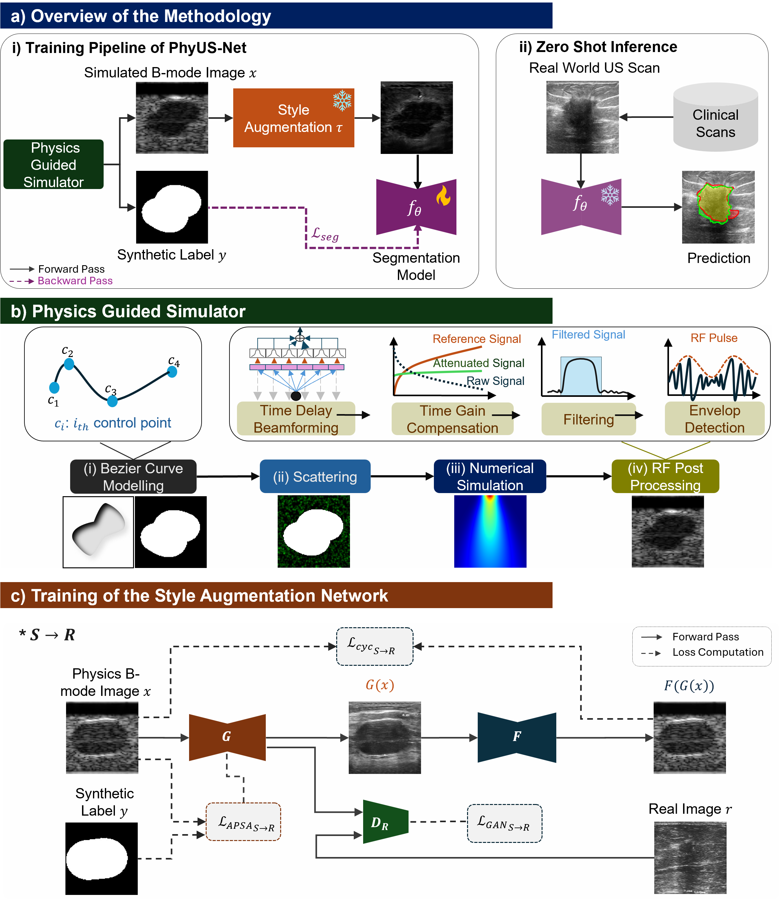

# Towards Generalizable Ultrasound Segmentation via 
Physics-Guided Supervision

This repository contains the official implementation of our paper "Towards Generalizable Ultrasound Segmentation via Physics-Guided Supervision".

## Summary

We propose a physics-guided ultrasound segmentation framework that simulates B-mode images by solving the acoustic wave equation and reduces the simulation-to-real gap using style-preserving adaptation. The resulting models generalize well across diverse clinical datasets and transfer effectively to downstream tasks.
This repository provides the simulation pipeline, style transfer, and segmentation training and evaluation code.



## Repository Structure

- `physics_guided_simulation/`: Physics-based ultrasound simulation pipeline (k-Wave).
- `phyusnet/`: Segmentation training, fine-tuning, and evaluation.
- `style_augmentation/`: Style transfer with an APSA-based novel loss; based on the original CycleGAN repo for reference.
- `benchmark_datasets/US30K/`: Clinical datasets organized by task.
- `assets/`: Paper figures used in this README.

## Installation

```bash
pip install -r physics_guided_simulation/requirements.txt
```

## Data

### Physics Simulation Output

The simulation pipeline generates B-mode images and corresponding labels. Outputs are referenced via an `.npz` file with `train`, `val`, and `test` splits, where each entry stores `(scan_path, label_path, sample_id)`. Please send an email to request access to the physics-based dataset of 10,000 segmentation tumors.

### Clinical Datasets

Clinical datasets are organized under `benchmark_datasets/US30K/`, each with `img/` and `label/` subfolders. Download the dataset package and train-test split information from the Google Drive folder [link]() (placeholder). Supported datasets include BUSI, UDIAT, TN3K, DDTI, MMOTU2D, and others.

## Usage

### 1. Physics-Guided Simulation

```bash
cd physics_guided_simulation
python run_python_pipeline.py --end-sample-id 100 --gpu --noise-levels low medium high
```

### 2. Style Augmentation (Synthetic-to-Real)

```bash
cd style_augmentation
python train.py
python test.py
```

Checkpoints for synthetic-to-real ultrasound transfer models are available in the Google Drive folder [link]() (placeholder).

### 3. Physics Pretraining

```bash
cd phyusnet
python main.py --dataset_path /path/to/physics_data/paths.npz --model_name segformer --epochs 100
```

All segmentation checkpoints are available in the Google Drive folder [link]() (placeholder).

### 4. Task-Specific Fine-Tuning

```bash
cd phyusnet
python task_specific.py --mode finetune --dataset_key BUSI --model_name segformer --epochs 50
```

### 5. Evaluation

```bash
cd phyusnet
python utils/test.py --benchmark_dataset BUSI --model_name segformer --task physics --checkpoint_folder_path ./checkpoints
```

## Results


Quantitative results report Dice, IoU, and HD95 across multiple datasets in the US30K benchmark, highlighting zero-shot generalization and transfer to downstream tasks.

## Checkpoints

- Physics-pretrained models: `phyusnet/checkpoints/physics_models/`
- Task-specific fine-tuned models: `phyusnet/checkpoints/task_specific_models/`
All checkpoints are also available in the Google Drive folder [link]() (placeholder).

## Citation

If you use this codebase, please cite the paper:

```bibtex
@article{haris2026physicsguided,
  title={Towards Generalizable Ultrasound Segmentation via Physics-Guided Supervision},
  author={Haris and collaborators},
  journal={Under review},
  year={2026}
}
```

## Acknowledgements

We thank the authors of k-Wave and the open-source implementations of UNet, UNet++, SegFormer, SwinUNet, and TransUNet. We also acknowledge the maintainers of segmentation-models-pytorch and the CycleGAN/pix2pix codebase used for style augmentation.