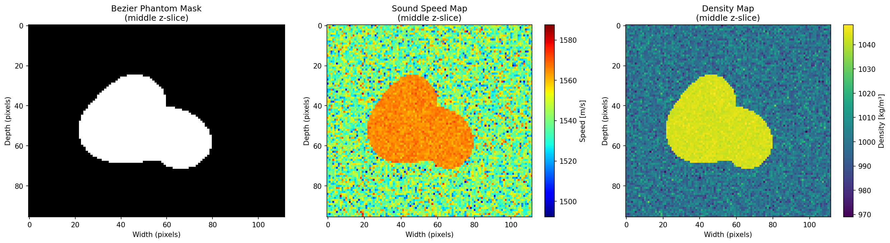

Physics Guided Simulator (PGS)
============================

Physics-guided simulator for generating paired ultrasound data and labels.

Install
-------

Python 3.8+ with the dependencies in `requirements.txt`.

```bash
conda create -n haris_kwave python=3.10
conda activate haris_kwave
python -m pip install -r requirements.txt
```

Run
---

```bash
conda run -n haris_kwave python run_python_pipeline.py --config example_config.json
```

Repository Structure
--------------------

- `core/`: Simulation, phantom preparation, and post-processing modules.
- `helpers/`: Shared configuration and file utilities.
- `run_python_pipeline.py`: Main pipeline entry point.
- `example_config.json`: Example configuration for paths and settings.
- `requirements.txt`: Python dependencies.
- `matlab_reference/`: MATLAB reference implementation used for parity checks.


Acknowledgement
---------------

We are grateful to the developers of the Python version of k-Wave.

Bezier Phantoms: 
-------

